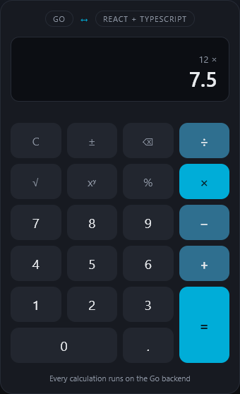

# Calculator — Go API + React/TypeScript frontend

A full-stack calculator in which **all the arithmetic happens on the server**: the
React frontend holds the keypad and the display state, and asks a Go API for
every result. Basic operations plus power, square root, and percentage.



## Architecture

Two layers on each side, and one defended boundary between pure logic and
transport on both:

```
 Browser                                          Server
┌─────────────────────────────────────────┐      ┌───────────────────────────────────────┐
│ components/   Display · Keypad · Button  │      │ cmd/server     wiring: PORT, timeouts, │
│      │ dispatch(action)                  │      │                graceful shutdown       │
│      ▼                                   │      │      │                                 │
│ hooks/useCalculator                      │      │      ▼                                 │
│   reducer  — pure state machine          │      │ internal/httpapi   decode · validate · │
│   effect   — the one side effect         │      │   Calculator interface   map errors    │
│      │ CalculatorClient (injected)       │      │      │ declared here, by the consumer  │
│      ▼                                   │ HTTP │      ▼                                 │
│ api/client    the only fetch, the only   │─────▶│ internal/calculator   operations table │
│               place that knows the URL   │ JSON │   no net/http, no encoding/json        │
└─────────────────────────────────────────┘      └───────────────────────────────────────┘
        interface → hook → client → HTTP → handler → domain
```

- **Backend.** `internal/calculator` is plain Go: an operations table, five
  sentinel errors, no HTTP and no JSON in its dependency graph.
  `internal/httpapi` is the only place where a domain error becomes a status
  code. `cmd/server/main.go` does wiring and nothing else.
- **Frontend.** The reducer in `hooks/useCalculator.ts` is a pure function with
  its transition table documented at the top of the file. `api/client.ts` is
  the only module that calls `fetch`. The client is injected into the hook,
  which mirrors the interface seam on the backend: one place to substitute a
  fake on each side.

```
backend/
├── cmd/server/            main.go, healthcheck.go
└── internal/
    ├── calculator/        calculator.go, errors.go        (domain)
    └── httpapi/           router.go, handlers.go, errors.go, types.go   (transport)
frontend/src/
├── api/                   client.ts, types.ts
├── components/            Display.tsx, Keypad.tsx, Button.tsx
├── hooks/                 useCalculator.ts
├── utilities/             formatNumber.ts
├── messages.ts            every visible string
└── App.tsx, main.tsx, styles.css
```

## Prerequisites

| To run | You need |
|---|---|
| locally | Go 1.27 or newer · Node 22 or newer (npm included) |
| with Docker | Docker with Compose v2 — nothing else |

## Run locally

Two terminals. The frontend development server proxies `/api` to the backend,
so the browser sees a single origin.

```bash
# Terminal 1 — API on http://localhost:8080
cd backend
go run ./cmd/server

# Terminal 2 — application on http://localhost:5173
cd frontend
npm install
npm run dev
```

Open <http://localhost:5173>.

| Variable | Where | Default | Meaning |
|---|---|---|---|
| `PORT` | backend | `8080` | Port the API listens on. If you change it, change the proxy target in `frontend/vite.config.ts` too |
| `VITE_API_URL` | frontend, build time | empty | Base URL of the API. Empty means same origin, which is what both the development proxy and Docker provide |

Keyboard: `0`–`9` `.` digits · `+` `-` `*` `/` `^` `%` operations · `Enter` or
`=` evaluate · `Backspace` delete · `Esc` clear.

## Run with Docker

```bash
docker compose up --build
```

Open <http://localhost:3000>. Stop with `Ctrl+C`, remove with `docker compose down`.

Two containers: **nginx** serves the built frontend and proxies `/api/` to the
**Go API**, which is not published on the host. The frontend waits until the
backend reports healthy. `FRONTEND_PORT` (default `3000`) and `BACKEND_PORT`
(default `8080`) can be overridden from the shell or a `.env` file.

## API reference

The examples run against the local backend on port 8080. With Docker, use
`http://localhost:3000` instead — nginx forwards `/api/`.

### `POST /api/v1/calculate`

Request body: an operation name and its operands.

| `operation` | Operands | Result |
|---|---|---|
| `add` | 2 | `a + b` |
| `subtract` | 2 | `a − b` |
| `multiply` | 2 | `a × b` |
| `divide` | 2 | `a ÷ b` |
| `power` | 2 | `a` raised to `b` |
| `squareRoot` | 1 | `√a` |
| `percentage` | 2 | `b` percent of `a`, that is `a × b ÷ 100` |

```bash
curl -s -X POST http://localhost:8080/api/v1/calculate \
  -H 'Content-Type: application/json' \
  -d '{"operation":"divide","operands":[10,4]}'
# 200  {"result":2.5}

curl -s -X POST http://localhost:8080/api/v1/calculate \
  -H 'Content-Type: application/json' \
  -d '{"operation":"squareRoot","operands":[9]}'
# 200  {"result":3}

curl -s -X POST http://localhost:8080/api/v1/calculate \
  -H 'Content-Type: application/json' \
  -d '{"operation":"percentage","operands":[200,15]}'
# 200  {"result":30}
```

### `GET /health`

```bash
curl -s http://localhost:8080/health
# 200  {"status":"ok"}
```

### Errors

Every error, from every endpoint, has the same envelope. Clients branch on
`code`; `message` is for people.

```bash
curl -s -X POST http://localhost:8080/api/v1/calculate \
  -H 'Content-Type: application/json' \
  -d '{"operation":"divide","operands":[10,0]}'
# 422  {"error":{"code":"DIVISION_BY_ZERO","message":"cannot divide by zero"}}

curl -s -X POST http://localhost:8080/api/v1/calculate \
  -H 'Content-Type: application/json' \
  -d '{"operation":"add","operands":[1]}'
# 400  {"error":{"code":"INVALID_OPERAND_COUNT","message":"invalid operand count: \"add\" takes 2, got 1"}}
```

A malformed request is **400**; a well-formed request that has no answer is **422**.

| Code | HTTP | When |
|---|---|---|
| `INVALID_JSON` | 400 | Body is not one JSON object, has unknown fields, or has a field of the wrong type |
| `UNKNOWN_OPERATION` | 400 | `operation` is not in the table above (names are case-sensitive) |
| `INVALID_OPERAND_COUNT` | 400 | Number of operands does not match the operation |
| `DIVISION_BY_ZERO` | 422 | `divide` with a divisor of 0 |
| `NEGATIVE_SQUARE_ROOT` | 422 | `squareRoot` of a negative number |
| `NON_FINITE_RESULT` | 422 | Result is NaN or infinite: overflow, `0` to a negative power, a fractional power of a negative base |
| `REQUEST_TOO_LARGE` | 413 | Body over 4096 bytes |
| `METHOD_NOT_ALLOWED` | 405 | Known path, wrong method; the `Allow` header names the right one |
| `NOT_FOUND` | 404 | Unknown path |
| `INTERNAL_ERROR` | 500 | Anything unexpected. The detail is logged and never returned |

## Testing

```bash
# Backend — table-driven domain tests and httptest handler tests
cd backend
go test ./...

# Frontend — reducer, hook, HTTP client, and integration tests
cd frontend
npm install
npm test
npx tsc --noEmit        # the lint gate: strict TypeScript, no separate linter

# Both coverage reports, regenerated into docs/coverage/
sh scripts/coverage.sh
```

| Layer | Tests | Statement coverage |
|---|---|---|
| `backend/internal/calculator` — domain | table-driven: every operation, every sentinel, overflow, `0.1 + 0.2`, percentage semantics | **100%** |
| `backend/internal/httpapi` — transport | `httptest`: each operation, each error code, malformed input, routing, panic recovery, a fake `Calculator` | **100%** |
| `backend/cmd/server` | health check subcommand, environment lookup | 26.2% — the remainder is `func main` |
| **Backend total** | 12 test functions, 70 cases | **78.5%** |
| **Frontend total** | 101 tests in 5 files | **99.26%** statements · 97.88% branches · 100% functions · 100% lines |

The HTML reports are committed: [backend](docs/coverage/backend.html) ·
[frontend](docs/coverage/frontend/index.html). Before the refactor the backend
stood at 10.1% and the frontend had no tests
([docs/ANALYSIS.md](docs/ANALYSIS.md), section 0.5).

How the frontend is tested, from the inside out:

1. **Reducer** — a table of `(before, action, after)` for every transition, and
   whole key sequences such as `5 + × 3 =` and `2 + 3 = = =`.
2. **Hook** — driven through a hand-settled fake `CalculatorClient`: success,
   rejection, the loading toggle, and `CLEAR` aborting a request in flight.
3. **Integration** — the real `App` and the real HTTP client, with Mock Service
   Worker standing in for the network: `2 + 3 = 5`, `10 ÷ 0` shows the error,
   keys disabled while loading, a stopped backend, the physical keyboard.

## Design decisions

| Decision | Chosen | Alternative considered | Why |
|---|---|---|---|
| API shape | Single `POST /api/v1/calculate` | One endpoint per operation | Uniform for unary and binary operations; the set of operations is data, not routing |
| Domain isolation | `internal/calculator` with no HTTP or JSON imports | Logic inside handlers | Testable with plain `go test`; the transport can change independently. A gate checks it: `go list -deps ./internal/calculator/` must not mention `net/http` |
| Error handling | Sentinel errors, mapped to HTTP in one function of the transport layer | Error strings or status codes in the domain | The domain never learns what 400 means |
| Error contract | One envelope with a machine-readable `code`, for every response including 404 and 405 | Free-text messages; the router's plain-text 405 | The frontend picks its own wording by code, and no client ever parses two error shapes |
| Extensibility | Operations table with `Arity` and `Apply` | A growing `switch` | Adding an operation touches one line; operand-count validation comes for free |
| Non-finite results | An error in the domain (`422 NON_FINITE_RESULT`) | Let `+Inf` or `NaN` reach the encoder | `encoding/json` fails on them; failing late would turn a user mistake into a 500 |
| Router | Standard library `net/http` with method patterns | Gin, Echo, Fiber | Nothing in a three-route API justifies a dependency. `go.mod` has none |
| Interface placement | `Calculator` declared in `httpapi`, the consumer | Declared next to the implementation | The consumer states what it needs; a test drives the handlers with a fake |
| Frontend state | `useReducer` in one hook | Redux, Zustand, scattered `useState` | A calculator is a state machine on a single screen with no shared state. Redux Toolkit was tried and reverted before this refactor — commits `b20a232` and `1b273e2` |
| Request guard | The reducer ignores input while a request is in flight | Disabled buttons only | Disabled buttons do not stop the physical keyboard; the old code could overlap requests |
| API access | One injected client | `fetch` in components or imported by the hook | One seam to fake; mirrors the dependency inversion on the backend |
| Visible text | Chosen by error code, all strings in `messages.ts` | Show the server message | The API speaks to developers, the interface to people; one file to review or translate |
| Layering depth | Two layers per side | Hexagonal or clean-architecture folders | Proportional to a calculator |
| Static files | nginx serves them; the Go binary is API only | The Go binary also serves `dist/`, as the original did | `main.go` stays wiring; the old catch-all route turned every 405 into a 404 and made the server refuse to start without a built frontend |
| Container layout | Two containers under Compose | One image where Go serves the frontend; both processes under a supervisor | A container is a process, not a virtual machine, so a second one costs almost nothing, and the backend stays a pure API |
| Backend image | `distroless/static`, non-root; the binary performs its own health check | `alpine` with `wget` | A static Go binary needs nothing from a system: no shell, no package manager. Cost: a 12-line `healthcheck` subcommand |
| Frontend image | `nginx:alpine` | A distroless image | Static files need a web server, and there is no official distroless nginx |
| Lint | Strict TypeScript (`strict`, `noUnused*`, `noUncheckedIndexedAccess`) and `go vet` + `gofmt` | ESLint | No linter existed and none was asked for; the compiler flags already fail the build |
| Naming | English, full words in every identifier, JSON field, CSS class, and comment | Keep the original Spanish names; conventional abbreviations | The code base was Spanish and the reviewers read English. Four `grep` checks ran before every commit. Allowed exceptions are Go idioms: `err`, `ctx`, `t *testing.T`, `cmd/` |

The state of the code before this work — inventory, captured API responses,
baseline numbers, and the rename tables — is kept as evidence in
[docs/ANALYSIS.md](docs/ANALYSIS.md). The plan that was followed is
[REFACTOR_PLAN.md](REFACTOR_PLAN.md); its Appendix D lists what was checked
against the assignment and built, kept, or deferred.

## Assumptions

- **Numbers are `float64`, passed through unrounded.** The API returns
  `0.30000000000000004` for `0.1 + 0.2`; a test pins that. Rounding is a display
  concern: the frontend shows ten decimal places and drops trailing zeros.
- **Percentage is binary**: `percentage(a, b)` is `b` percent of `a`. `200 % 15 =`
  shows `30`. The assignment does not define it; this reading fits the
  two-operand flow of the other keys.
- **Square root is unary** and evaluates the display at once, keeping a pending
  operation: `9 + 16 √ =` is `13`.
- **No operator precedence.** Operations chain left to right, as on a pocket
  calculator: `2 + 3 × 4 =` is `20`.
- **`=` does not repeat** the last operation, and `5 + =` uses the display as the
  right operand, giving `10`.
- **A failure keeps the display and clears the pending operation**, so the next
  digit starts a new calculation.
- **Input is capped at 15 digits**, the number of significant decimal digits a
  `float64` round-trips.
- **The server is the source of truth.** The frontend blocks what it can know
  is pointless (a second decimal point, leading zeros, input during a request);
  it never decides that a calculation is invalid.
- **Interface and API text are English**, like the reviewers.
- **Same origin everywhere.** The development proxy and nginx both put the API
  under the origin of the page, so the API sends no CORS headers.

## What I'd do with more time

- `GET /api/v1/operations`, so the keypad could be built from the server's
  table instead of a TypeScript union kept in step by hand. Deferred: nothing
  consumes it today.
- CORS middleware with an allowed origin from the environment, for deployments
  where the frontend and the API do not share an origin.
- Reject `null` inside `operands`. Go's `encoding/json` decodes it as `0`.
- Keep the full-precision result after `=`. Chained operations already do; after
  `=` the next operation starts from the ten-decimal value on the display.
- Continuous integration: both test suites, the naming checks, and the coverage
  reports on every push, instead of committed HTML.
- A browser end-to-end test in that pipeline. The flows were verified by hand
  with Playwright against the running backend and against Docker.
- ESLint with the React hooks rules.
- Request identifiers and the response status in the access log.
- Decimal arithmetic, if exact decimal results mattered more than range.

## AI usage

The prompts used during this work are in [PROMPTS.md](PROMPTS.md), in order,
each with what was done with the answer.
